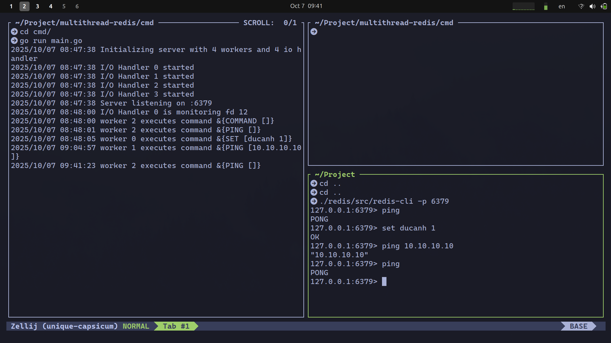

<h1 align="center">RediGo</h1>

<p align="center">
<pre>
                            ██████  ███████ ██████  ██  ██████   ██████
                            ██   ██ ██      ██   ██ ██ ██       ██    ██
                            ██████  █████   ██   ██ ██ ██   ███ ██    ██
                            ██   ██ ██      ██   ██ ██ ██    ██ ██    ██
                            ██   ██ ███████ ██████  ██  ██████   ██████
</pre>
</p>

<p align="center">
  <em>⚡ A Redis-like multithread in-memory datastore built in Go from scratch ⚡</em>
</p>

<div align="center">

[](https://opensource.org/licenses/MIT)
[](https://golang.org)
[](https://github.com/spaghetti-lover/RediGo/stargazers)

</div>

<a name="table-of-contents"></a>

## Table of contents

- [Table of contents](#table-of-contents)
- [Description](#description)
- [Installation](#installation)
  - [Requirements](#requirements)
  - [Clone the project](#clone-the-project)
  - [Usage](#usage)
- [Features](#features)
- [TODO](#todo)
- [License](#license)

<a name="description"></a>

## Description

This project is a from-scratch implementation of a Redis-like in-memory data store written in Go, focusing on I/O Model, RESP protocol, core commands, data structures, caching, and concurrency model.

- CLI:

<!-- - UI:
   -->

<a name="installation"></a>

## Installation

<a name="requirements"></a>

### Requirements

- Go 1.24+
- (Optional) Docker or Podman for containerized deployment

<a name="clone-the-project"></a>

### Clone the project

```bash
git clone https://github.com/spaghetti-lover/RediGo.git
```

<a name="usage"></a>

## Usage

### Run the project

- Run CLI

```bash
go mod tidy
go run cmd/main.go
```

- Run with Docker-compose

```bash
make dev
```

- Run with Docker (single container), useful for deployment

```bash
make deploy
```

### Connect with redis-cli (optional)

```bash
redis-cli -p 6379
```

### Benchmark

```bash
./redis/src/redis-benchmark -p 3000 -t set -n 1000000 -r 1000000

./redis/src/redis-benchmark -n 1000000 -t get -c 500 -h localhost -p 3000 -r 1000000 --threads 3
```

<a name="features"></a>

## Features

- [x] ⚡ Server models: Simple TCP server, Thread Pool, One thread per connection, I/O multiplexing (`epoll`, `kqueue`), Shared-nothing architecture

- [x] 🔗 Protocol: Redis Serialization Protocol (RESP)

- [x] 🛠️ Core Commands:

  - [x] **Hash Map**: `GET`, `SET`, `TTL`, `DEL`, auto key expiration
  - [x] **Simple Set**: `SADD`, `SREM`, `SMEMBERS`, `SISMEMBER`
  - [x] **Sorted Set**: `ZADD`, `ZSCORE`, `ZRANK` (with both skip list and B+ Tree)
  - [x] **Count-min Sketch**: `CMS.INCRBY`, `CMS.QUERY`, `CMS.INITBYDIM`
  - [x] **Bloom Filter**: `BF.ADD`, `BF.EXISTS`, `BF.RESERVE`

- [x] 🔑 Passive, Active expired key deletion

- [x] 🧹 Caching: Random, approximated LRU, approximated LFU

- [x] 🧵 Graceful shutdown and connection handling

<a name="todo"></a>

## TODO

- [ ] Implement server model io_uring (Linux)
- [ ] [Geospatial](https://redis.io/docs/latest/develop/data-types/geospatial/)
- [ ] List
- [ ] Bitmap
- [ ] HyperLogLog
- [ ] Queue
- [ ] [Pipeline](https://redis.io/docs/latest/develop/using-commands/pipelining/)
- [ ] Authentication
- [ ] Persistence: RDB, AOF

<a name="license"></a>

## License

[MIT](https://choosealicense.com/licenses/mit/)
