# TCP SERVER

# Redis Intro
## What
Redis (REmote DIctionary Server) is an **open-source, in-memory, key-value store**, known for its speed and simplicity. It has the following characteristics:

- **Open-source**: The community edition remains free, while enterprise use requires a commercial liscence.
- **In-memory**: Redis stores data in RAM instead of disk, offering faster access. Here's a comparison:
  - **Disk-based storage**:
    - Cost-effective: Typlically cheaper than RAM.
    - High capacity: Offer more storage space than RAM.
    - Persistent: Data is retained even after shutdown.

  - **RAM-based storage:**
    - **Faster**: Memory access is significantly faster than disk.
    - **Volatile**: Data is lost on shutdown unless explicitly persisted.


- **NoSQL key-value database**:
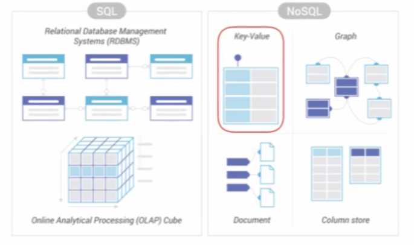
NoSQL databases are categorized into several types, each designed for different use cases:
  - **Graph:**
    - Best suited for relationship-heavy data, such as social networks.
    - Examples: Neo4j, Facebook TAO.

  - **Document stores:**
    - Store semi-structured data in formats like JSON or BSON.
    - Suitable for content management systems, catalogs, etc.
    - Example: MongoDB, CouchDB.

  - **Column Store:**
    - Optimized for analytical workloads and wide tables.
    - Less common in transactional applications.
    - Examples: Apache Cassandra, HBase.

  - **Key-value:**
    - Store data as a collection of key-value pairs.
    - Redis is a popular example in this category.
    - Key-value stores are highly scalable, both vertically and horizontally
    - Examplee: Redis, Amazon DynamoDB, Memcached

## Why
### Pros
- **Open-source**
- **High performance**:
  - **Low latency**: Writeen in C++ and stores data in RAM, allowing sub-millisecond responses.
  - **High throughput**: Capable of handling hundreds of thousand of operations pers second.
- **Simplicity**: Offers a simple API with basic commands like `GET` and `SET`
- **Rich data structures**: Supports advanced types such as hashes, sets, sorted sets, bitmaps, geospatial indexes, and bloom filters.

### Cons
- **Risk of data loss**: As an in-memory store, data can be lost if not persisted or backed up properly.
- **No complex querying**: Lacks a full-featured query language like SQL.
- **Single-threaded**: By default, Redis uses a single core, which limits its ability to leverage multi-core CPUs.
- **Limited relational modeling**: Not ideal for applications with complex data relationships or constraints.

## When
### Caching:

*Figure: Redis used as a caching layer to reduce database load.*
#### What
Redis is commonly used as a caching layer to improve performance. The reason lies in the **80/20 rule**: around 20% of data is typically accessed by 80% users. This high concentration of access make Redis very effective. Therefore, by storing the frequently accessed 20% of data in RAM (via Redis), application can reduce database load and significantly decrease response times.

#### Why
This pattern allows:
- **High cache hit ratio**: Most requests can be served from Redis.
- **Faster performance**: RAM access is much faster than disk.
- **Efficient storage usage**: Redis handles hot data, while the main database stores cold data.

#### How
1. The application requests data.
2. The server checks Redis (the cache):
   - If the data **exists in the cache** (cache hit), it is returned immediately.
   - If the data **does not exist** (cache miss), the server fetches the data from the database.
3. After a cache miss, the server writes the newly fetched data back to Redis for future requests.

### Session storage:
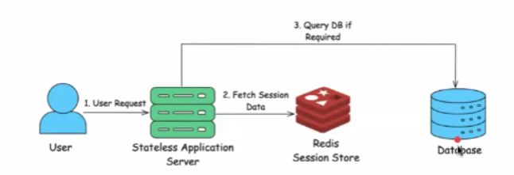
#### What
Session management tracks user interaction across web application. It has the following steps:
1. When a user logs in, a session ID is created and stored in Redis.
2. This session is used to authenticate requests without requiring re-login.

#### Why
Traditional method for session storage like cookies, database, Hash Map have the following drawbacks:
- Cookies: Require client-side storage, prone to theft if not secure (XSS, CSRF), and have size limits.
- Relational Database: High latency for frequent read/write operations as it require disk I/O.
- In-memory Hash: Not distributed; sessions are lost if the server restarts or scales horizontally.
=> Redis solves these problems because:
- It's in-memory: fast read/write
- Distributed and persistent options: supports scaling and failover.
- Built-in TTL (Time To Live): automatically expires old sessions.

#### How
1. Generate session ID when user log in.
2. Store session data in Redis with a TLL.
3. Send session ID to the client (cookie or HTTP header).
4. On each request:
- Extract session ID from the request.
- Query Redis:
  ```go
  userID, err := rdb.Get(ctx, sessionID).Result()
  ```
  - If exists: authenticate user.
  - If missing or expired: reject request.
- Logout: Delete session from Redis `(rdb.Del(ctx, sessionID))`.

### Distributed lock
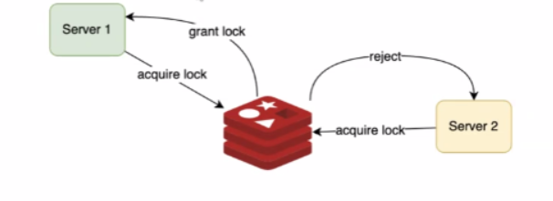

There are still many use cases but this the major ones

# What is going on in a server
## In Hardware
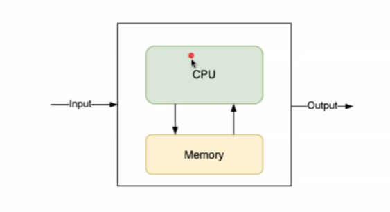
1. CPU
2. Memory (RAM)
3. I/O

When CPU computation complete, data is trnasfer to Memory

## In Software
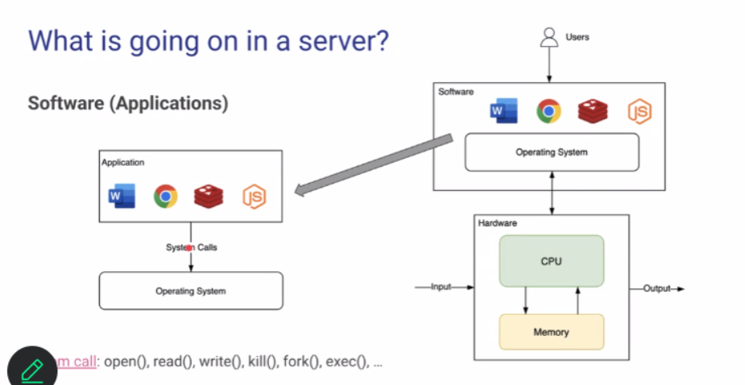
- Users only interact with Software.
- Software interacts with Hardware through OS. Because if you let Software interact directly with Hardware, it will be very difficult.
- Software interact with OS through some APIs called `System call`: open(), read(), write(), kill(), fork(), exec(),...

### Applications:
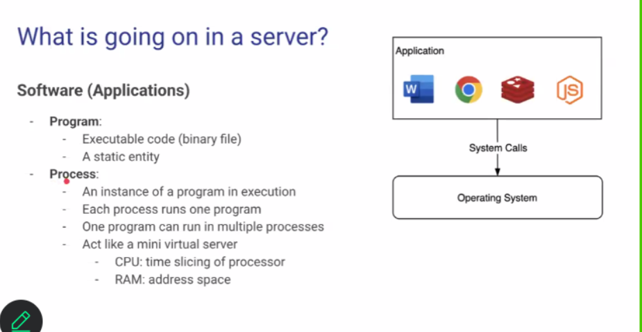
- Program:
  - Executable code (binary file)
  - A static entity
- Process:
  - An instance of a program in execution
  - Each process runs one program
  - One program can run in multiple processes
  - Act like a mini virtual server
    - CPU: time slicing of processor
    - RAM: address space
- OS Thread:
  - An object of activity within the process.

- User space thread:
  - Threads managed by thread library in user space. Ex: JVM, golang runtime
  - Lightweight and faster than kernel thread
  - Is created to utilize OS thread only when need computing. For example: when download file, user space 1 does not use OS thread.
  - Create and Delete user space thread is faster than OS thread.

  - 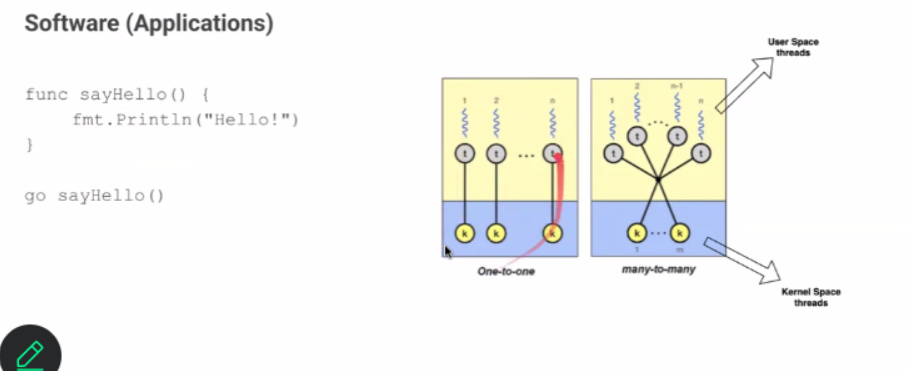
    - Golang is many-to-many

- Multi-threading programming

  Pros:
  - Better performance: concurrency/parallelism
  - Better resource utilization

  Cons:
  - Complex, hard to debug
  - Race condition.

#### Race condition:
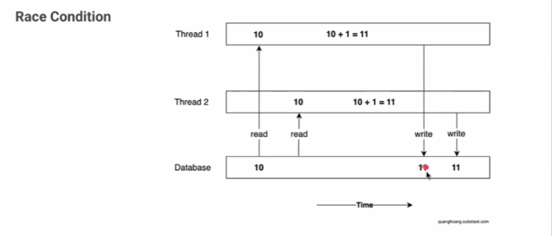
Even in 1 CPU 1core case, it still can happen. Because maybe when thread 1 read 10 and thread 2 read 10 afterward. Thread 1 and thread 2 can write 11 to database simultaneously. So the result of this code is still unpredictable
```go
package main

import (
	"fmt"
	"runtime"
	"sync"
)

var counter int = 0

func increment() {
	counter = counter + 1
}

func main() {
	runtime.GOMAXPROCS(runtime.NumCPU())
	var wg sync.WaitGroup
	wg.Add(10)
	for i := 0; i < 10; i++ {
		go func() {
			defer wg.Done()
			increment()
		}()
	}
	wg.Wait()
	fmt.Printf("counter = %d\n", counter)
}
```
=> Race condition could be solved with **locking**. However, locking also have some drawbacks:
- Lock contention, bottleneck
  - **Context Switching Overhead:** when a thread is Lock, CPU scheduler make it sleep, then it have to make it ready for running.
  - **Complex, debugging difficulties:** Heisenbug, which can be described in this meme
    

# Communication
## What
- Protocol: TCP, UDP, HTTP/HTTPS (TCP chỉ qtam đến việc deilivery còn HTTP add thêm các metadata)
- Redis uses `RESP` (REdis Serialization Protocol) on top of TCP

## Why
- Why doesn't Redis use HTTP protocol?
  - Minimized overhoead: verbose text-based headers, verbose status codes, content negotiation, cookies, etc.
  - Efficient Parsing: simple, much easier to parse than JSON/XML
  - No Web browser access: a backend service, no need to care for Web browser
Pros:
- Simple
- Leverage Multi-Core Processors
- Handles Blocking I/O

Cons:
- Memory overhead: each thread requires its own stack space. Too many thread -> overload
- CPU overhead: context switching
- Risk of race condition

## How
1. Thread per connection
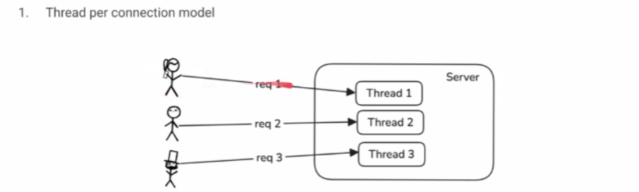

### What
- Every time a client sends a request, the server creates a new thread to handle it. (1 thread = 1 request)

### Why
**Pros:**
- Simple
- Leverages multi-core processors
- Handles blocking I/O
  Each request runs in its own thread. If a connection is blocked during read/write I/O, only that thread is blocked. Other threads continue running.

**Cons:**
- Memory overhead: each thread requires its own stack space
- CPU overhead: context switching
- Risk of race conditions

2. Thread pool
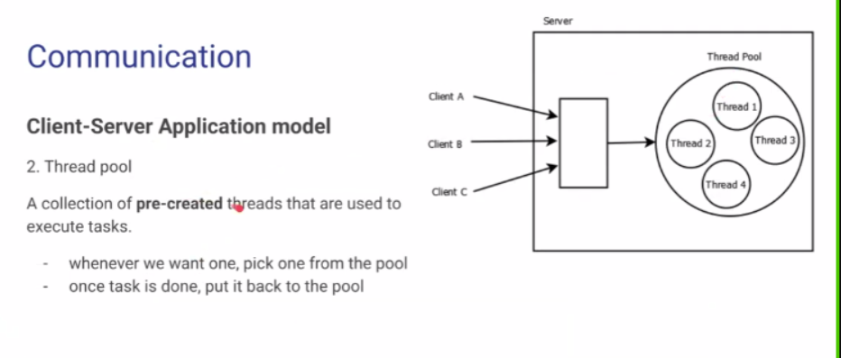
### Why
**Pros:**
- avoid overload the hardware

**Cons:**
- Hard to choose the pool's size
- A bit more complex
- Risk of race condition
- Overhead for very short tasks: Task management costs (enqueue/dequeue, locking, wakeup, context switching) can exceed the task’s execution time.

3. Event Loop
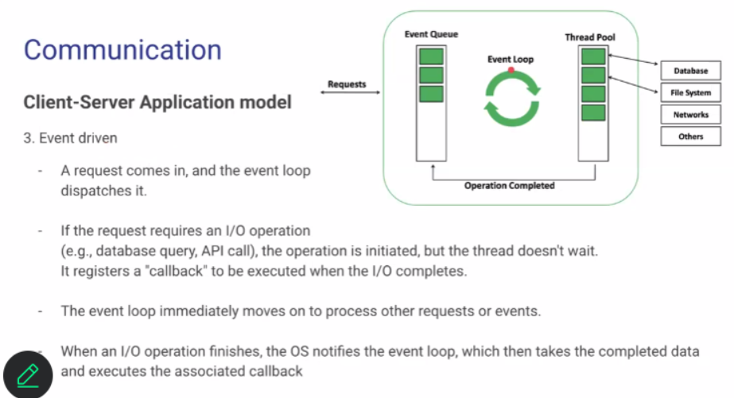
### Why
**Pros:**
- Scalable for I/O bound appplication
- Efficient Resource Usage: avoid context switching because of single thread
- Reduce race condition risk

**Cons:**
- Complex
- CPU-Bound Operations Block Everything: I/O bound task can make thread pool busy, but most of the time

Redis use Event-driven but doese not have thread pool

### How
1. A request arrives. The event loop receives it and puts it into the **event queue**.
2. The event loop takes an event from the queue and checks its type:
  - **I/O non-blocking** (socket read/write, network polling): The event loop registers the operation with the OS kernel. The OS kernel waits for the I/O to complete and notifies the event loop when it is done.
  - **I/O blocking or CPU-bound** (disk I/O, DNS lookup, compression, encryption): The event loop sends the task to the **thread pool** to avoid blocking. The thread pool processes the task and returns the result to the event loop through a callback or completion event.

3. The event loop places the completed event into the event queue.
4. The event loop retrieves the completed event and calls the callback function to continue processing the request.

=> Thread pool and Thread per connection is suitable for CPU bound. Event loop is for I/O bound.

# TCP Server
A TCP server is a process that runs on a computer and is designed to **listen for , accept** and **mangage incoming** network connections from clients using TCP protocol.

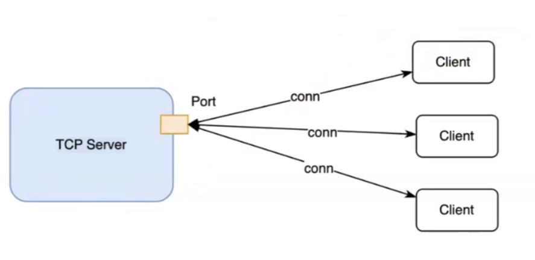

## What
1. Passive listening for new connections at a port
  - A port == A door = (server IP address + port)
  - E.g.localhost:3000

2. Accepting Connections:
  - Establish a dedicated communication channel (a socket)
  - A socket = (server ip + server port + client ip + client port)
  - Local setup: TCP server runs at localhost:3000, clients runs at localhost:3001

3. Bidirectional
  - All subsequent requests and responses go through established socket

