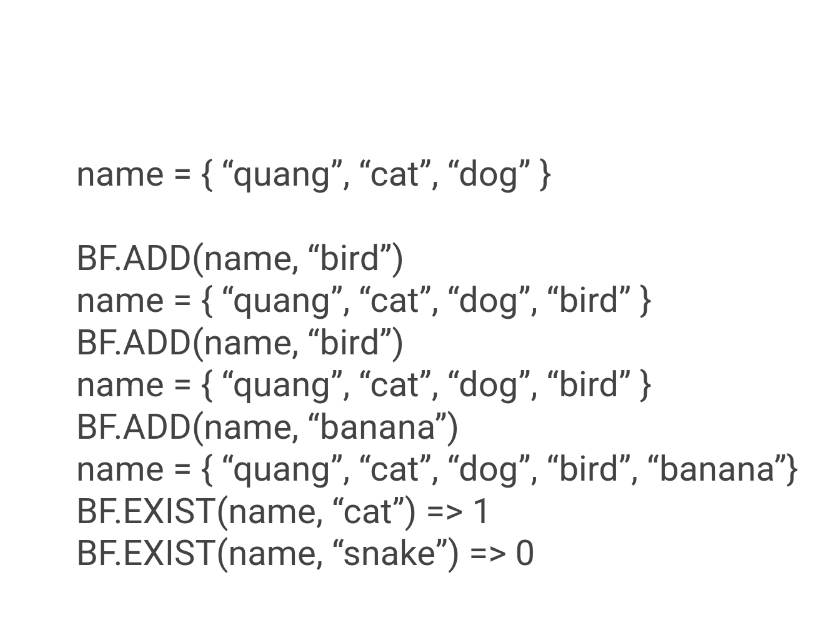
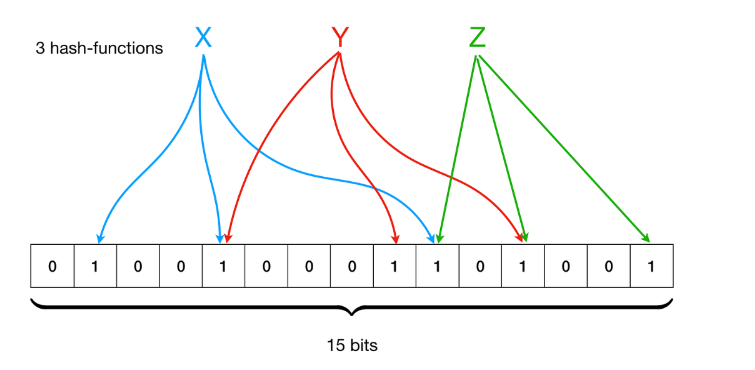

# Bloom Filter

## What

- Bloom Filter are a **probabilistic data structure** that **checks for presence of an item in a set**
- Commands:
  - `BF.RESERVE key error_rate capacity`
    - error_rate: The desired probability for false positives.
    - capacity: The number of entries intended to be added to the filter.
  - `BF.MADD key item [item ...]`
  - `BF.EXISTS key item`
- For example:
  
- Source code: https://github.com/RedisBloom/RedisBloom/blob/master/deps/bloom/bloom.c

## Why

**Problem**
Imagine you need to store one million unique URLs to quickly check if a new URL has been seen before. Each URL is, on average, 50 characters long.

**Option 1:** Hash Set

- Data: 1,000,000 URL x 50 bytes = 50,000,000 bytes
- Kích thước: ~50MB

**Option 2:** Bloom filter

- 1% error rate
- ~1.14MB

=> Bloom Filter cut down memory by ~40x memory with 1% error rate

## How

### How it works?

- Bit Array: An array of m bits, where each bit is initially set to 0.
- Hash Functions: A collection of k different, independent hash functions that map elements to a position within the bit array

1. Add a element
   

2. Checking for an Element
   Feed the element through the same k hash functions to get k indices. You then check the bits at each of these indices.

- If any of the bits is 0, the element is definitely not in the set.
- If all of the bits are 1, the element might be in the set.
