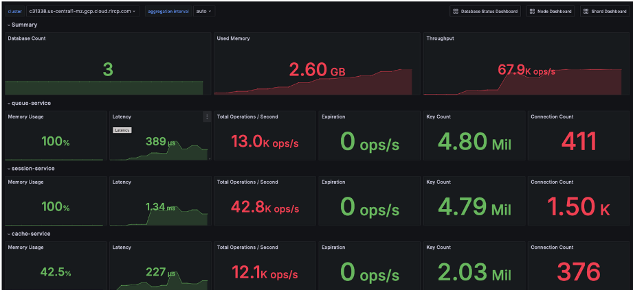
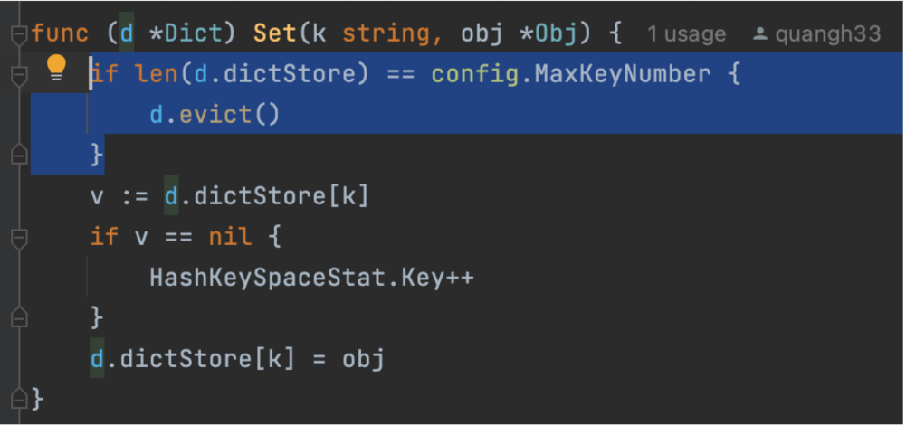
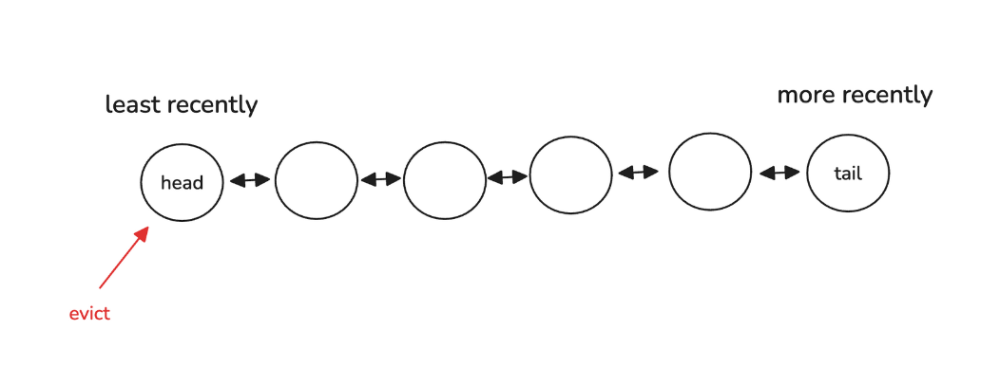
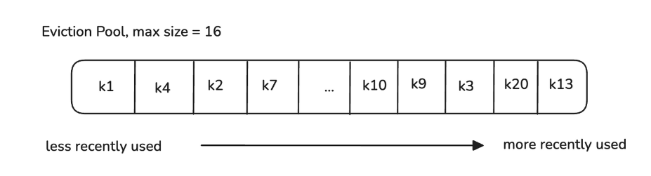
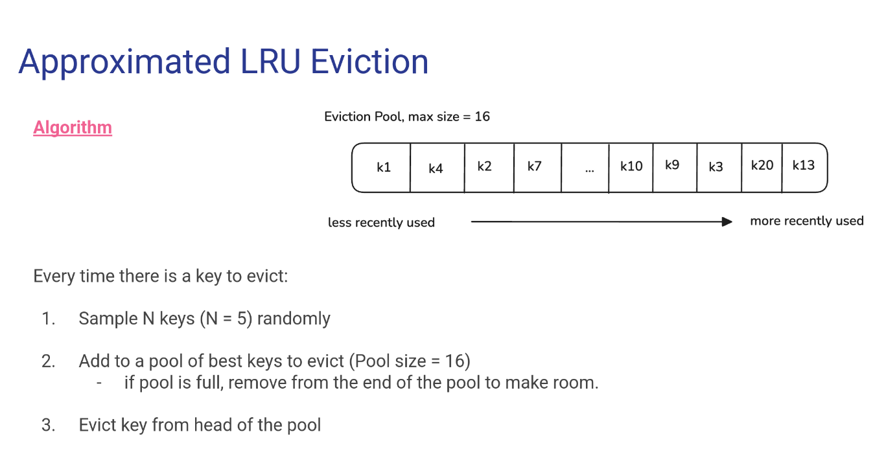
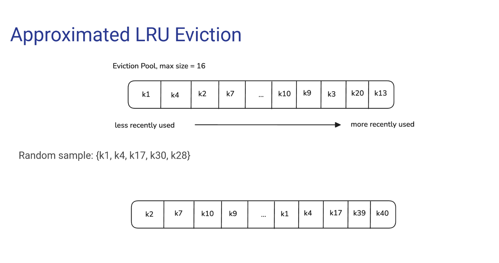

# INFO Command

## What

- `INFO [section [section ...]]`
- Returns **information** and **statistics** about the server that easy to parse by computers and read by humans.
- Keyspace Session: Provides information about the number of keys in each database and the number of keys with an expiration set.

  - Example output:

    ```
    # Keyspace
    db0:keys=1,expires=0,avg_ttl=0
    db1:keys=2,expires=1,avg_ttl=5000
    ```

    - `db0` and `db1` are the database numbers.
    - `keys` indicates the total number of keys in the database.
    - `expires` indicates the number of keys with an expiration set.
    - `avg_ttl` indicates the average time to live (in milliseconds) of keys

  - This project will focus on the followings Keyspace metrics:
    - The number of keys in the dictionary
    - The number of expired keys
    - The average time to live

## How

```go
type KeySpaceStats struct {
  Key       int64
  Expire    int64
}
var HashedKeySpaceStat = KeySpaceStat{Key: 0, Expire: 0}
```

```go
func (d *Dict) Set(k string, obj *Obj) {
  v := d.dictStore[k]
  if v == nil {
    HashedKeySpaceStat.Key++
  }
  d.dictStore[k] = obj
}
```

```go
func (d *Dict) Del(k string) {
  if _, exist := d.dictStore[k]; exist {
    delete(d.dictStore, k)
    delete(d.expireDictStore, k)
    HashedKeySpaceStat.Key--
    return true
  }
  return false
}
```

```go
func cmdINFO(args []string) []byte {
	var info []byte
	buf := bytes.NewBuffer(info)
	buf.WriteString("# Keyspace\r\n")
	buf.WriteString(fmt.Sprintf("db0:keys=%d,expires=0,avg_ttl=0\r\n",
		data_structure.HashKeySpaceStat.Key))
	return Encode(buf.String(), false)
}
```

## When


Monitoring Redis stats using Prometheus and Grafana

# Cache Eviction

## What

- **Cache eviction** is the process of **removing data** from a cache to **make space for new** items when the cache reaches its capacity.
- In Redis:

  - [maxmemory](https://redis.io/docs/latest/develop/reference/eviction/#maxmem): a configuration that specifies the maximum amount of memory to use for the cache data.
  - **zmalloc**: an internal function Redis uses to allocate and track memory usage.
    (In our simplified implementation, we replace this with **maxKeyNumber**, which limits the number of keys.)

- Redis supports different eviction [policies](https://redis.io/docs/latest/develop/reference/eviction/#eviction-policies)
  - noeviction: no evict, return error for new items
  - **allkeys-random**: evict key at random
  - **allkeys-lru**: evict the least recently used key
  - **allkeys-lfu**: evict the least frequently used keys
  - ...

## Random Eviction

### What

- Random Eviction evicts keys at **random**

### How




### When

- You expect all keys to be accessed with roughly equal frequency.

## LRU Eviction

### What

- LRU Eviction evices the **least recently used** (LRU) keys:
- Example: **maxKeyNumber=5**

  - set k1 1
  - set k2 2
  - set k3 3
  - set k4 4
  - set k5 5

  - set k6 6=> remove?
  - get k2
  - get k3
  - set k7 7=> remove?

### How



- Use a double linked list to track the order. References: https://leetcode.com/problems/lru-cache/submissions/780791338/

- Complexity:

  - Time: O(1)
  - Space: O(maxKeyNumber)

- Algorithm:
  
  Every time there is a key to evict:

1. Sample N keys (N=5) randomly
2. Add to a pool of best keys to evict (Pool size = 16)

- if pool is full, remove from the end of the pool to make room.

3. Evict key from head of the pool

### When

- You expect that a subset of elements will be accessed far more often than the rest.

## Approximated LRU Eviction

### What




### Why

- Traditional LRU algorithm requires O(maxKeyNumber) space for double linked list => waste of memory

### How

```go
type Obj struct {
  Value interface{}
  LastAccessTime uint32
}
```

```go
type EvictionCandidate struct {
  key string
  lastAccessTime uint32
}
```

```go
type EvictionPool struct {
  pool []*EvictionCandidate
}
```
