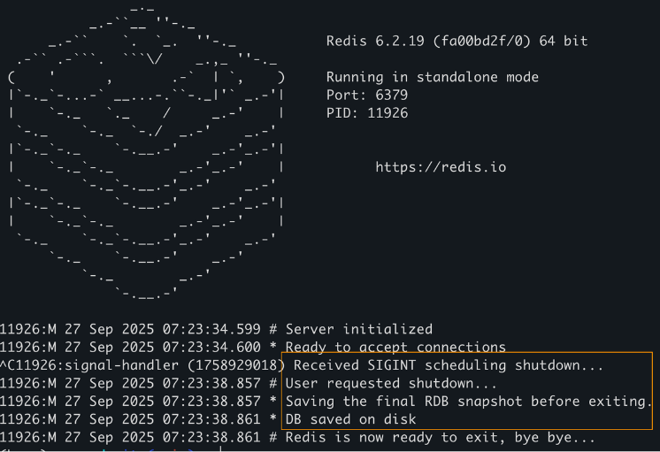
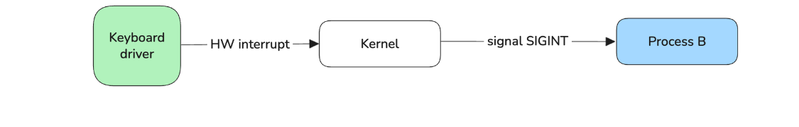
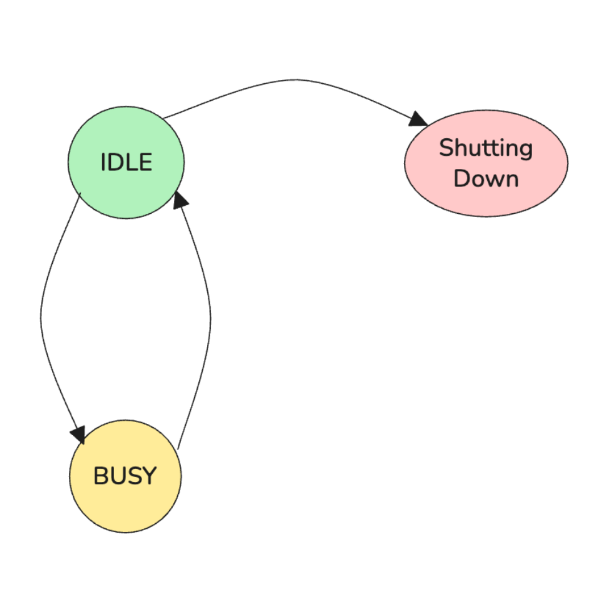

# Gracefully Shutdown



## What

A graceful shutdown is a controlled sequence of actions running application take when it told to stop

## Why

1. Prevent data loss

- Rollback database transactions
- Saving logs
- Wait for ongoing commands to finish

2. Release resources
3. Client notification

## Signal

### What

- Signals are a form of inter-process communication (IPC) used in Unix-based operating system.
- They are asynchronus sent to a process to indicate an event has occurred
- Example:
  - sudo kill -SIGTERM <pid>
    
  - Ctrl+C
    
  - Common signals:
    - SIGINT: Interrupt from keyboard (Ctrl+C)
    - SIGKILL: Kill signal (cannot be caught or ignored)
    - SIGFPE: Error in arithmetic operation

### How

- When a process receives a signal, it can:

  1. Execute the default action associated with that signal

  - If the application has no signal handler, the default action is executed
  - for example, the default action for SIGINT is to terminate the process

  2. Ignore the signal

  - The process can instruct the kernel to simply discard the signal and take no action
  - Crucial Note: SIGKILL (immediate termination) and SIGSTOP (stop execution) cannot be ignored

  3. Execute a User-Defined Signal Handler

  - The kernel pauses the normal execution of the process and forces it to execute a specific signal handler written by the developer

- Implement (Signal in Golang - os/signal package)

  - Shutdown:

  ```go
  func main() {
      fmt.Println("Process ID:", os.Getpid())
      // 1. Create a channel to receive system signals.
      // This channel will be the asynchronous endpoint for signal notifications.
      sigs := make(chan os.Signal, 1)

      // 2. Register the signals we want to catch.
      // We want to catch SIGINT (interrupt from terminal)
      signal.Notify(sigs, syscall.SIGINT, syscall.SIGTERM)

      // 3. Create a channel to block the main goroutine until a shutdown is complete.
      done := make(chan bool, 1)

      go func() {
          sig := <-sigs
          fmt.Printf( format: "\n\n[HANDLER] Received signal: %v\n", sig)
          // Signal the main goroutine that the handler has finished and it's safe to exit.
          done <- true
      }()

      fmt.Println( a...: "[MAIN] Waiting for work or signal...")
      <-done
      fmt.Println( a...: "[MAIN] Application shut down successfully.")
  }
  ```

  - Wait for ongoing tasks to finish:
    

    - Using a variable to track the current state of server:
      - BUSY: it is doing something
      - IDLE: it is not doing anything
      - SHUTTING_DOWN: it is in the process of shutting down

    Only shutdown when the state is IDLE

  ```go

  ```
