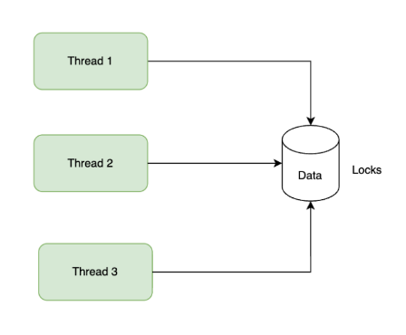
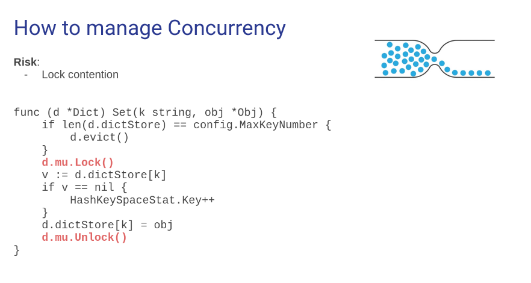
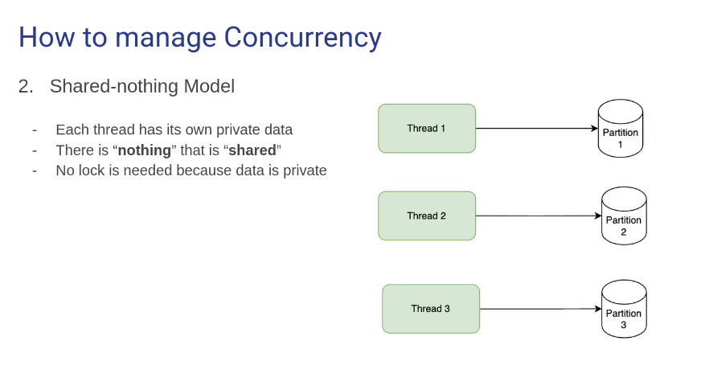
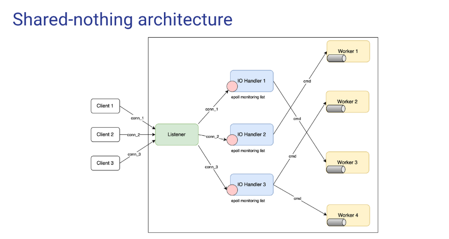
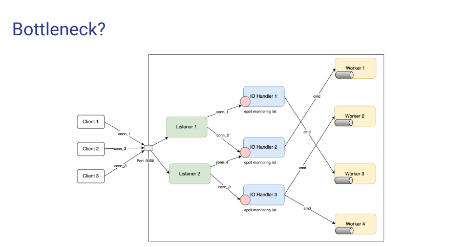
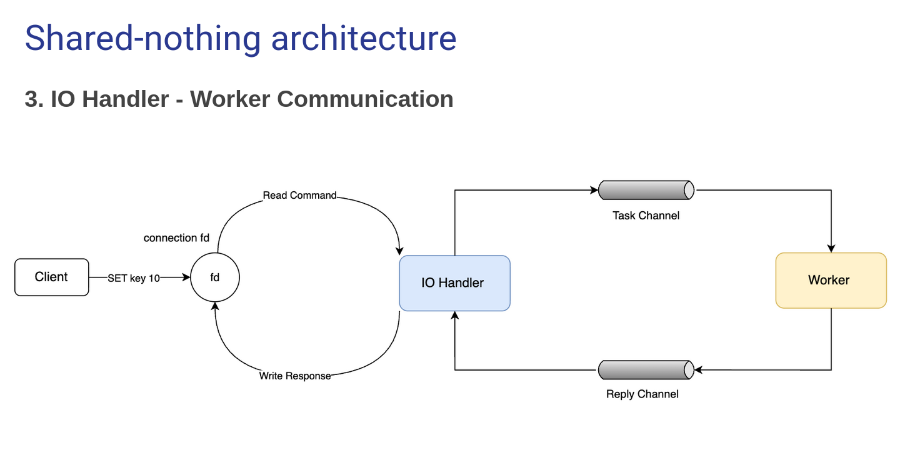
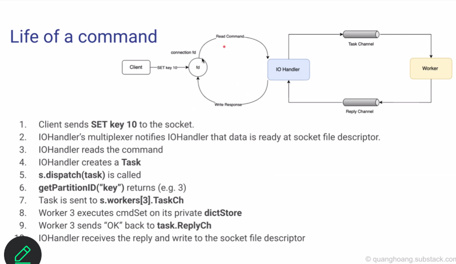

# Multi-threading

## Shared-Memory Model



### What

- All threads access the same data with Mutex Locks to protect from race condition.

### Why

Cons


- Lock contention

## Shared-Nothing Model



### What

- Each thread has its own data, no sharing.

### Why

Pros

- No lock is needed.

Cons

- No sharing, data partitioning is needed.

=> Choose Shared-Nothing model for better performance.

## Shared-Nothing Architecture



### What

3 components:

- Listener
- IO Handler
- Worker

### Why

Pros

- No lock is needed

Cons

- Bottleneck at Listener if there are too many new connections (e.g. 1M+ connections)
  => Improve by having multiple Listeners.
  
  => But only one Listener can bind to a port because of security issue. One **process** can eavesdrop on the traffic of another **process**.
  => Use SO_REUSEPORT option to allow multiple Listeners to bind to the same port.

### How

#### 1. Listener:

- A regular TCP Server
- Listen to new connection from client
- WHen there is a new conn, choose a IO Handler, and add the new conn (file descriptor) to the epoll monitoring list of that IO Handler.

#### 2. IO Handler:

- Monitor conn file descriptor for I/O
- If there is new command sent from client
  - extract the key
  - compute the **Worker_Id = hash(key) % workerNumber**
  - send command to the Worker

#### 3. Worker:

- Manage the data parition
- Execute the command sent from IO Handler
- Response to IO Handler
  - IO Handler write to the conn fd

#### 4. IO Handler - Worker Communication



1. IO Handler sends command to Worker through a channel
2. Worker processes the command
3. Worker sends the result back to IO Handler through another channel

- Implementing the "Worker":

```go
type Worker struct {
    id         int
    dictStore  *data_structure.Dict // Data partition, owned exclusively by a single worker
    TaskCh     chan *Task            // Receives tasks from the I/O goroutine
}

func NewWorker(id int, bufferSize int) *Worker {
    w := &Worker{
        id: id,
        dictStore: data_structure.CreateDict(),
        TaskCh: make(chan *Task, bufferSize),
    }
    go w.run()
    return w
}

type Task struct {
    Command *Command
    ReplyCh chan []byte // Channel to send the result back to IO Handler
}

// The worker's main loop
func (w *Worker) run() {
    for task := range w.TaskCh {
        w.ExecuteAndResponse(task)
    }
}
```

- Implementing the "Router":

```go
func (s *Server) getParitionID(key string) int {
  hasher := fnv.New32a()
  hasher.Write([]byte(key))
  return int(hasher.Sum32()) % s.workerNumber
}

func (s *Server) dispatch(task *core.Task) {
  var key string
  var workerID int

  if len(task.Command.Args) > 0 {
    key = task.Command.Args[0]
    workerID = s.getParitionID(key)
  } else {
    workerID = rand.Intn(s.workerNumber)
  }

  s.workers[workerID].TaskCh <- task
}
```

- Example life cycle of a command:
  

1. Client sends **SET key 10** to the socket
2. IOHandler's multiplexer notifies IO Handler that data is ready at socker file descriptor
3. IOHandler reads the command
4. IOHandler creates a **Task**
5. **s.dispatch(task)** is called
6. **getParitionID(key)** computes the worker ID (e.g. 3)
7. Task is sent to Worker 3's TaskCh
8. Worker 3 processes the command, updates its own dictStore
9. Worker 3 sends "OK" back to IO Handler through task.ReplyCh
10. IO Handler writes "OK" to the socket file descriptor
11. Client receives "OK" response

## Note

### SO_REUSEPORT

#### What

- A socket option that allows multiple sockets on the same host to bind to the same port number. When a new connection alive, Kernel automatically distributes it to one of the waiting listeners.

#### How

- Each socket is created with `SO_REUSEPORT` option before calling `bind()`.
- The kernel groups these sockets together.
- When packets arrive, the kernel load-balances them across the sockets — typically using a hash of the 5-tuple (src/dst IP, src/dst port, protocol) to ensure connection affinity.

```go
for i := 0; i < listenerNumber; i++ {
    lc := net.ListenConfig{
        Control: func(network, address string, c syscall.RawConn) error {
            var operr error
            err := c.Control(func(fd uintptr) {
                operr = syscall.SetsockoptInt(int(fd), syscall.SOL_SOCKET, syscall.SO_REUSEPORT, 1)
            })
            if err != nil {
                return err
            }
            return operr
        },
    }
    ln, err := lc.Listen(context.Background(), "tcp", s.address)
    if err != nil {
        log.Fatalf("failed to listen: %v", err)
    }
    listener, ok := ln.(*net.TCPListener)
    if !ok {
        log.Fatalf("failed to cast to TCPListener")
    }
    go s.startListener(listener)
}
```

#### When

- When there are many new connections (e.g. 1M+ connections), a single Listener becomes a bottleneck.
- We ensure that all Listeners are safe.

### In linux, thread == process ???

**1. CPU's points of view:** Excutes instructions. The CPU doesn't distinguish between threads and processes.

**2. Linux's scheduler's point of view:** Manages tasks (threads, processes, etc.) as schedulable units.

**3. OS /Kernel's point of view:** Processes are containers for threads. Threads are the actual units of execution.

**4. User-space point of view:** Users see processes and threads (via APIs like `pthread_create`). Higher-level runtimes (like Go) manage goroutines, which are mapped to OS threads by the Go runtime scheduler.

### Socket in for 4 levels of abstraction

**1. CPU’s point of view:** Executes syscall instructions (e.g. `send()`, `recv()`,...). The CPU itself has no concept of sockets.

**2. Linux scheduler’s point of view:** Sees **tasks** in various states—running, sleeping, or waiting on I/O (for example, waiting for socket readiness).

**3. OS /Kernel's point of view:**

- `struct socket` – High-level representation of a network endpoint.
- `struct sock` – Protocol-specific representation (for example, TCP, UDP).
- **State**: LISTEN, ESTABLISHED, CLOSE_WAIT, and others.
- **Ownership**: Each socket belongs to a process through its file descriptor table, and can be shared among threads of that process.
- **Routing**: The kernel routes incoming packets to the correct socket based on the 5-tuple (source IP, destination IP, source port, destination port, protocol).

**4. User-space point of view:** Sockets appear as **file descriptors**. Applications interact using standard APIs — `socket()`, `bind()`, `listen()`, `accept()`, `connect()`, `send()`, `recv()`, etc.

### IO_URING

To be continue...
