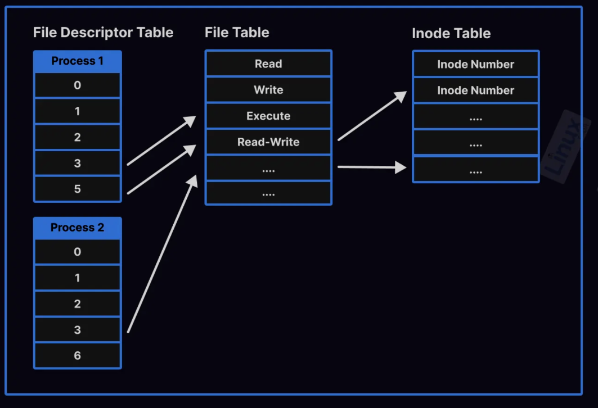
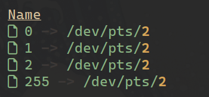
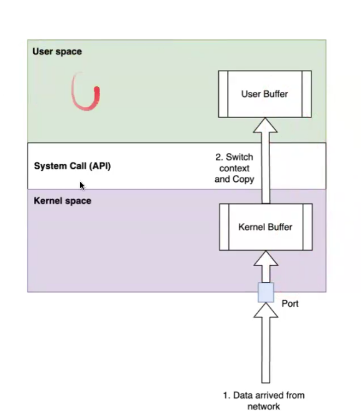
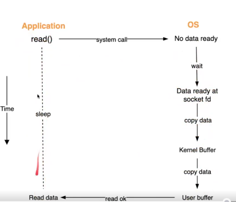
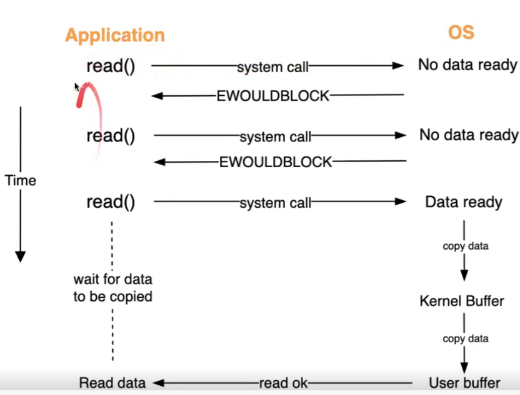
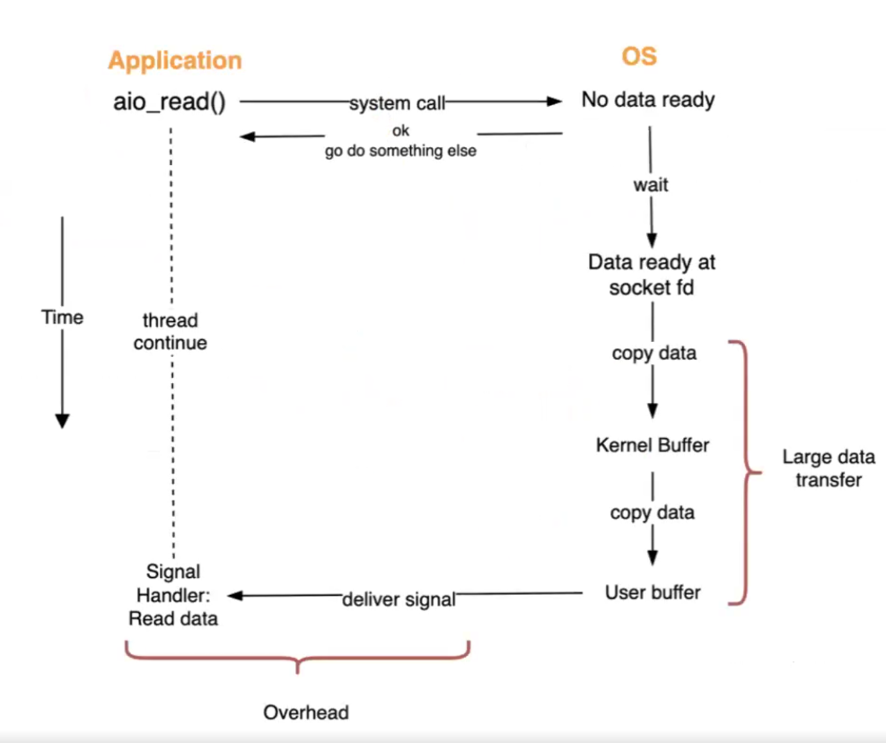
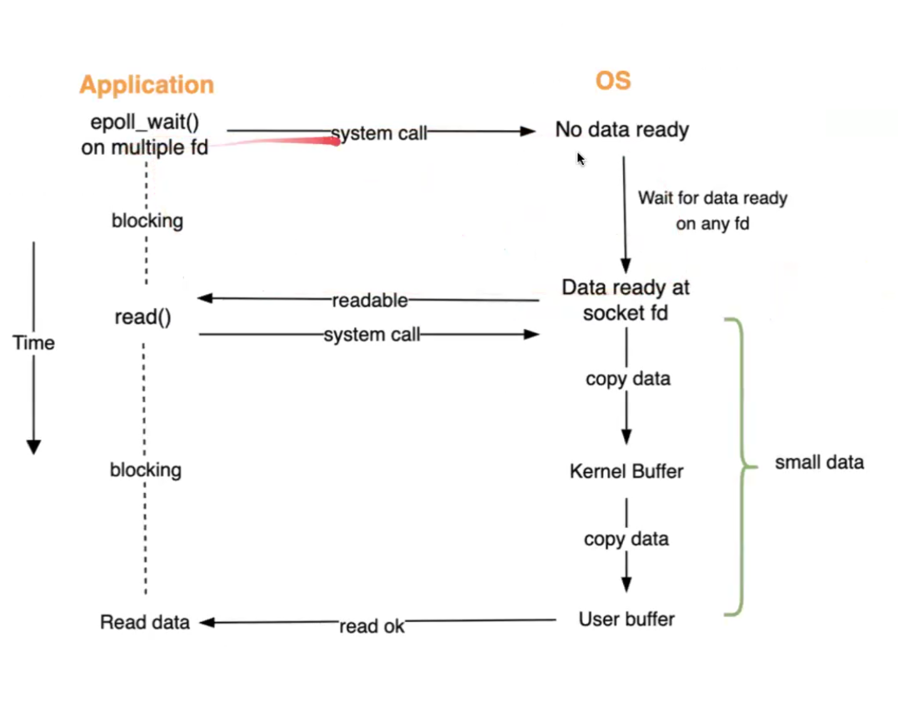

# Implement Thread Pool and TCP Server

## "Everything is a file"

### What

- The **UNIX philosophy** is often quoted as **everything is a file**, but that really means **everything is a stream of bytes.**
  - A file == A stream of bytes.
  - Everything is a file (in Linux): file, directory, socket, device, file,...

### Why

Pros

- Simple and consistent interface to manage different resources.
- Abstraction: abstracts away the complex, low-level details of hardware interaction.
- Unified, reusable tools: cat, grep, awk, seq
- Unified namespace: Many resource are represented as entries in the hierarchical filesystem

Cons

- There is not true or wrong, just because the philosophy of designer.

## File descriptor



### What

- An integer that identifies an open file of a process
  - Local to a process, each process has a table of File descriptor
  - Act like an interface for process to read, write, open, close a file
- Example:
  ```
  fd = create("hello.txt", 777) // tao file moi ten "hello.txt" roi tra ve file descrirptor
  write(fd, "hi", 2) // chi can truyen file descriptor khi goi syscall
  ```
  
- It is like **index** for file access
- Component:
  - File descriptor table: list of interger point to file table
  - File table: maintains the record of file modes like (r)read, (w)write, and (e)execute
  - Inode table: actual file information like size, modification date, pointer, etc

### Why

- **Secure**: The file descriptor, along with the file table, keep track of each running process’s permissions in your system and maintain data integrity.
- **Reusable**: A running process can inherit the functionality of another process by inheriting its file descriptor
- **Convenient**: Abstracts away low-level file details. Just need integer, no need to manage file pointer

### How

- List all the file descriptors and the files they refer to under a certain PID
  ```bash
  ls -la /proc/11472/fd/
  ```
  - Command to find processID: `ps aux | grep <name of process>`

### Note

- For more info: https://linuxtldr.com/file-descriptors-linux/

## I/O models



### 1. Blocking I/O

#### What



#### Why

Applications cannot access hardware directly. They must use syscalls via kernel space.

- **Security:** Kernel validates and protects hardware access.
- **Isolation:** A crash in user space does not crash the whole system.

Pros:

- Simple to implement.

Cons

- Process is blocked even when it could do other work.
- CPU overhead due to context switching.

#### How

1. Application issues `read()` system call.
2. OS checks socket/file descriptor:

- If **no data read** -> process waits (sleeps).
- If **data ready** -> continue

3. **Network → Kernel buffer:** NIC copies data into kernel buffer.
4. **Kernel buffer → User buffer:** CPU switches to user mode and copies data to user space.

- Example: `var buf []byte = make([]byte, 4096)`

5. OS returns → application wakes up and receives data.

### 2. Non-Blocking I/O

#### What



#### Why

Pros:

- Application is not blocked while waiting for data.
- Useful for simple polling loops.

Cons:

- Application must repeatedly poll for data (busy waiting).
- Wastes CPU cycles.

Rarely used nowadays because it wastes CPU cycles

#### How

1. Application issues `read()` system call.
2. OS checks socket/file descriptor:

- If **no data read** -> EWOULDBLOCK
- If **data ready** -> continue

3. **Network → Kernel buffer:** NIC copies data into kernel buffer.
4. **Kernel buffer → User buffer:** CPU switches to user mode and copies data to user space.

- Example: `var buf []byte = make([]byte, 4096)`

5. OS returns → application wakes up and receives data.

#### Note

EWOULDBLOCK = "I don't have the data, try again later"

### 3. Async I/O

#### What

<p align="center">
  
  <br>
  <em>"Do this read/write for me, and tell me when it's done"</em>
</p>

#### Why

Pros:

- Non-blocking: application continues work while I/O runs in background.
- Ideal for operations with high latency (disk I/O, large file transfer).

Cons:

- Extra overhead for small or frequent I/O.

#### How

**Key word**: Similar to Blocking I/O but the difference is while waiting for data, thread do other things.

1. Application issues read()/write() with async flag.
2. Kernel starts I/O operation.
3. While I/O runs, the application thread can do other work.
4. Kernel notifies application when I/O completes (e.g., signal, callback, event).

#### When

- Best option when data is large: database, file system
- Receive data from socket usually don't use Async I/O because data is small
  => Not suitable for Redis

### 4. I/O Multiplexing

#### What



#### Why

Pros:

- Efficient when handling many connections with small data (e.g., Redis, Nginx).
- One thread can manage thousands of sockets.

Cons:

- Heavy task can cause thread block.

=> Suitable for Redis

#### How

1. Application creates an epoll instance using `epoll_create()`.
2. Application registers file descriptors with `epoll_ctl()`.
3. Application calls `epoll_wait()`

- OS blocks until one or more file descriptors are ready.
- Returns a list of ready file descriptors

4. Application issues `read()/write()` system calls on those ready descriptors (same as blocking I/O)

- Command:
  - `epoll_create()`: create an epoll instance, return epoll FD
  - `epoll_ctr()`: add/remove a FD to the monitoring list
  - `epoll_wait()`: wait and return FDs that are ready for IO
