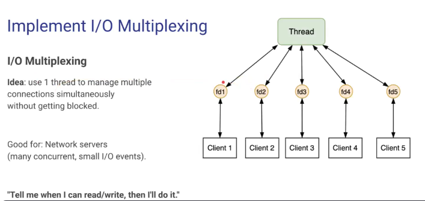
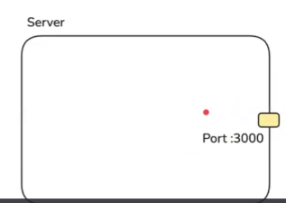
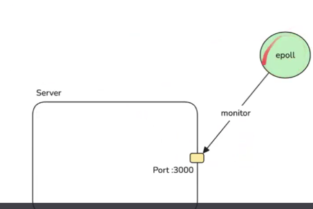
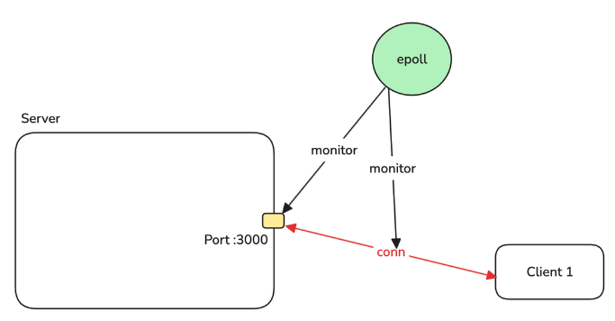
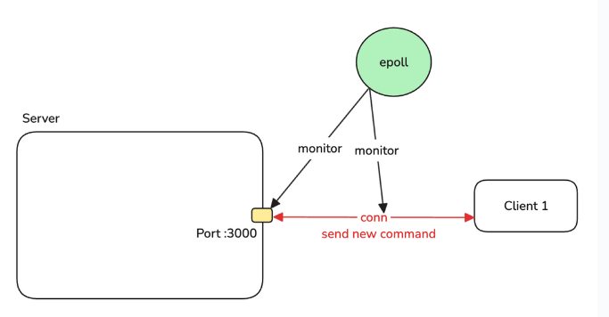
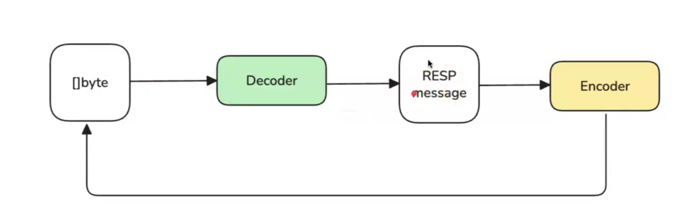
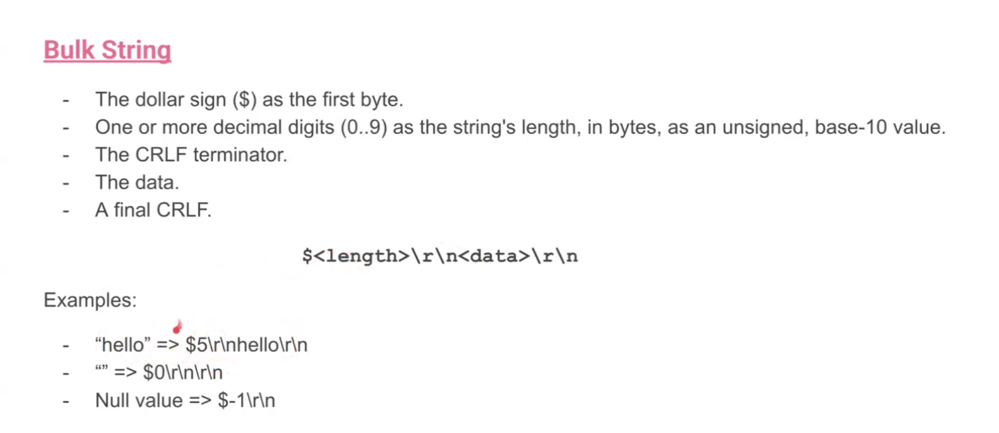
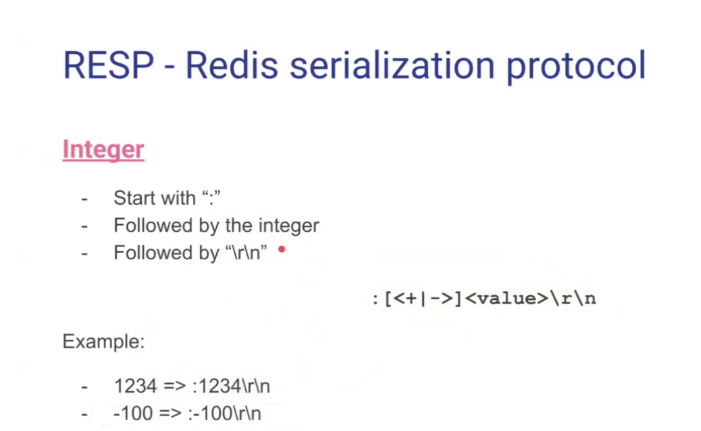
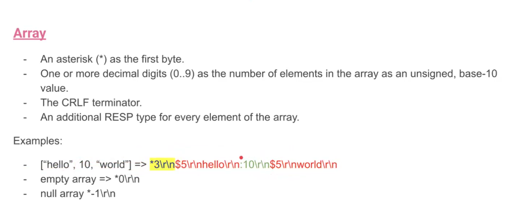

# RESP

## Implement I/O Multiplexing

- **Step 1**: Create a Listener File Descriptor (FD) that listens to port 3000
  

- **Step 2**: Create an epoll instance and let it monitor Listener FD
  

- **Step 3**: 2 situations:

1. A new client want to make a TCP connection to Server:

- Epoll notifies Server
- Create a new connection
- Add conn to the monitoring list of epoll
  

2. Existing client send a new command to Server:

- Epoll notifies Server
- Server read from connection
- Server process the command
- Server replies client
  

Note: Epoll hoạt động dựa trên hardware

## RESP - Redis serialization protocol

### What?

[RESP](https://redis.io/docs/latest/develop/reference/protocol-spec/) is the protocol for Redis client to communicate with Redis server:

### Why?

Redis needs a lightweight protocol that is more efficient than HTTP. RESP uses minimal overhead: each message requires only the length of string plus 3 additional bytes (`len(s) + 3`).

Pros:

- Reliable (on top of TCP)
- Simple to implement
- Fast to parse
- Human readable

Support different types of data:

- String
- Array
- Integer, Double
- Boolean
- Error ...

### How?

#### Decoder and Encoder

1. Client sends parsed string

- Simple string (when send simple data): 2. Server parses that string with the following rules:

  - Starts with "+".
  - Followed by the string.
  - Followed by by "\r\n".
  - Can't contain "\r\n".

  E.g: client send "+hello\r\n" -> Server parse into "hello"

- Bulk string (when send complex data)
   2. Server parses that string with the following rules: - The dollar sign ($) as the first byte. - One or more decimal digits (0..9) as the string's length, in bytes, as an unsigned, base-10 value. - The CRLF terminator. - The data. - A final CRLF

  E.g: - "hello" => $5\r\nhello\r\n - "" => $0\r\n\r\n - Null value => $-1\r\n

- Integer:
   2. Server parses that string with the following rules: - Start with ":" - Followed by the integer - Followed by "\r\n"

  E.g: - 1234 => :1234\r\n - -100 => :-100\r\n

- Array:
   2. Server parses that string with the following rules: - An asterisk (\*) as the first byte. - One or more decimal digits (0..9) as the number of elements in the array as an unsigned, base-10 value. - The CRLF terminator. - An additional RESP type for every element of the array.

  E.g: - ["hello", 10, "world"] => *3\r\n$5\r\nhello\r\n:10\r\n$5\r\nworld\r\n - empty array => *0\r\n - null array \*-1\r\n

- Error:
   2. Server parses that string within the following rules: - Start with "-" - Follow by message - Follow by CRLF "\r\n"

  E.g: - Key Not Found\r\n

- I only list the most common ones. There are many more types that is covered in Redis docs.n

## Benchmark

1. Clone this [Repo](https://github.com/quangh33/Nietzsche/blob/main/doc/Redis_CLI.md) first
2. Run this command `./redis/src/redis-benchmark -n 10000 -t ping_mbulk -c 200 -h localhost -p 3000`

- 1000 requests
- 200 parallel clients
