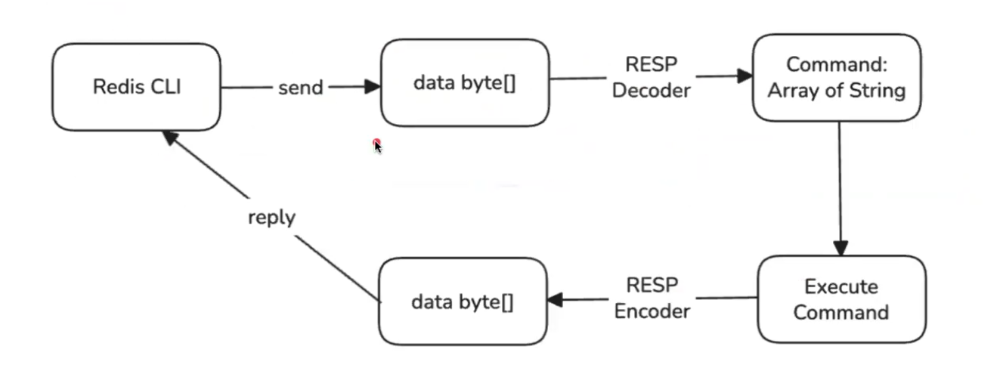
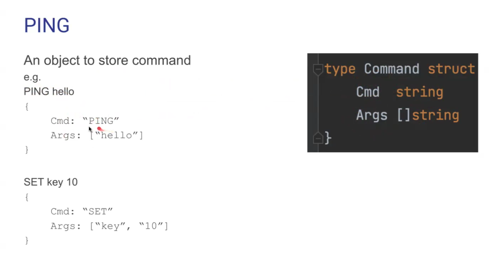
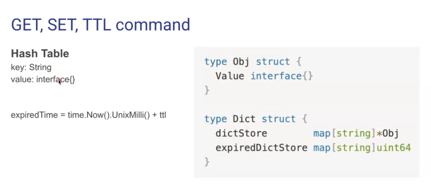
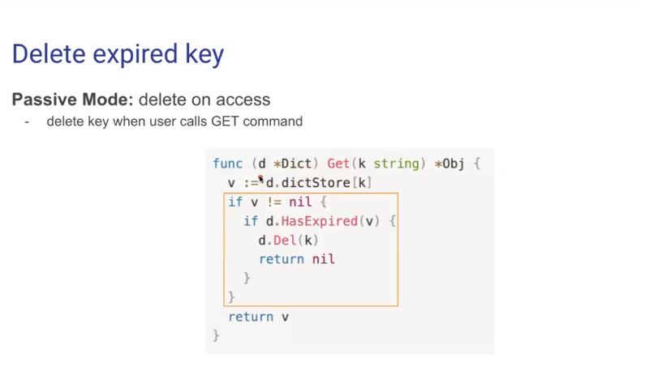
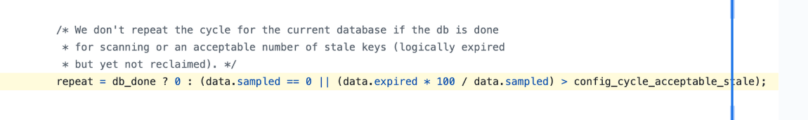
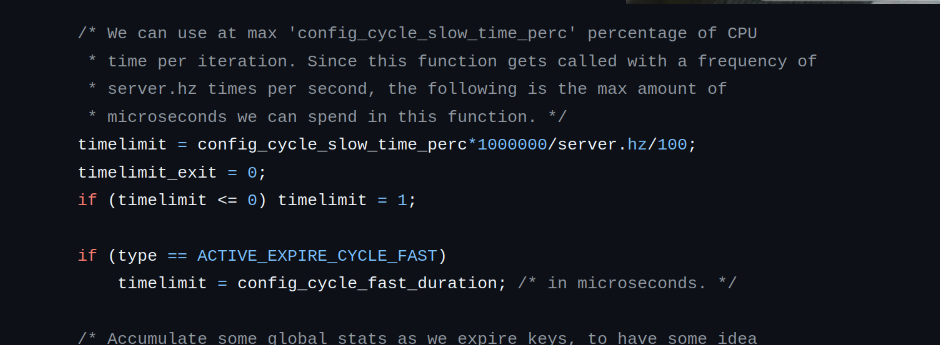

# PING

# SET, GET, TTL

## What

- [SET](https://redis.io/docs/latest/commands/set/)
- [GET](https://redis.io/docs/latest/commands/get/)
- [TTL](https://redis.io/docs/latest/commands/ttl/)

## How

- Cause Redis store data in key-value. Therefore, using the hash table will be a viable option
  

- Option 1 (Passive Mode)
  

  - GET:

    - check exist
    - check expire: exp <= uint64(time.Now().UnixMilli())
      - if expire: delete from hash table
      - else: return value

  - SET:
    - calculate expire time
    - insert to hash tables

=> Data which is never accessed will stuck in the Redis forever

- Option 2 ([Active Mode](https://valkey.io/commands/expire/)):
  
  - Sampling:
    - every 100ms:
      - sampling 20 keys with expire time
      - calculate number of expired key in the sample
        - delete them
        - if the number of delete > 10%, repeat. Repeatation exceed time limit will be stopped
          
