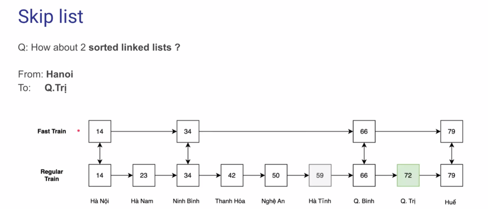
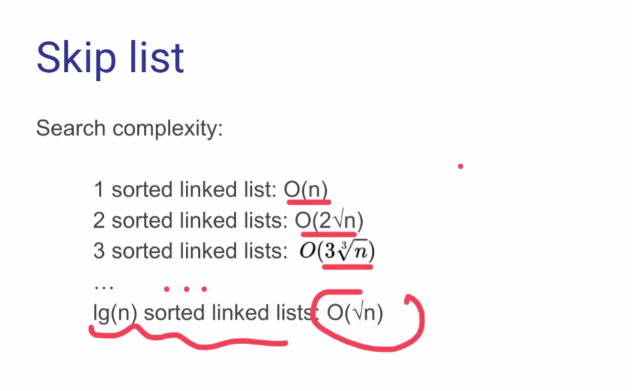
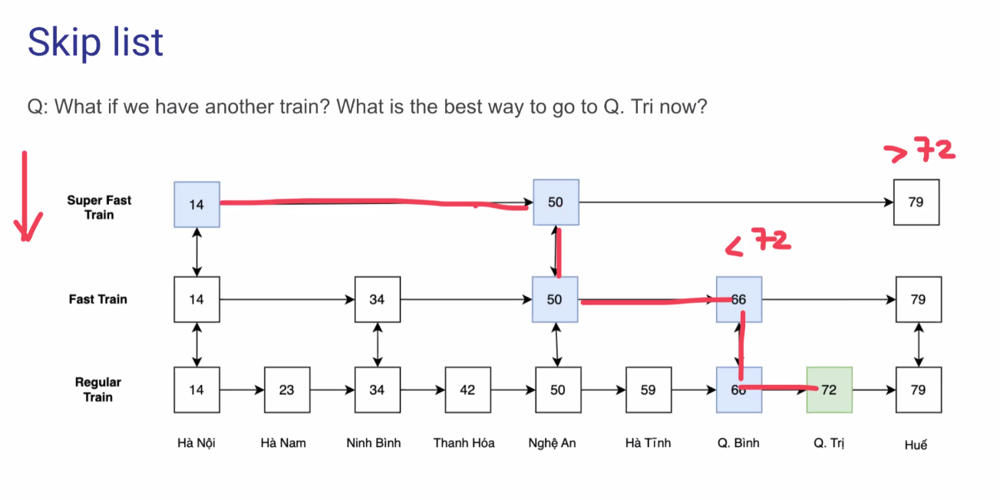

# Skip List

## What?

- A probabilistic data structure that allows for efficient searching, insertion, and deletion of elements
- More detail: https://www.youtube.com/watch?v=2g9OSRKJuzM
- Redis uses Skip List + Hash Table for search
- Space: O(N)

## Why?

We want to achieve O(logN) with search in linked list

Pros:

- Easy to implement
- Search, Insertion, Delete: average O(log n), worst case O(n)

Cons:

- Unstable runtime
- High memory over head for each node

## How?

### Insert
1. Step 1: Insert it into level-0 list
2. Step 2: Flip a coin, if head: promote 1 level and repeat, else: stop

### 

Read this article: https://wiki.vnoi.info/algo/data-structures/Skip-Lists
