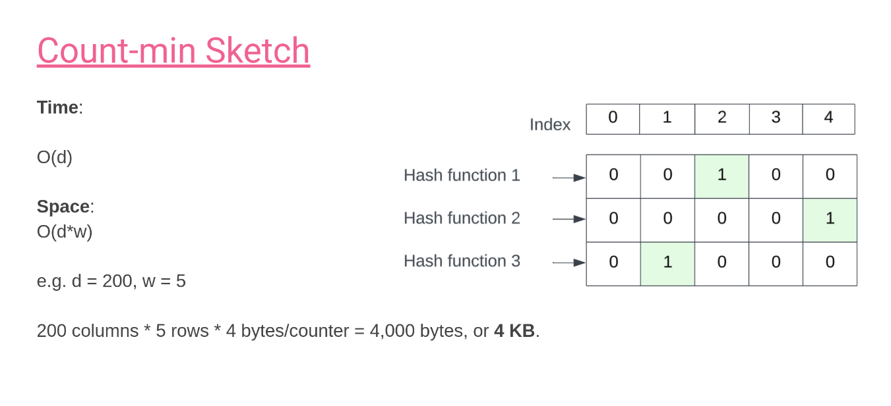
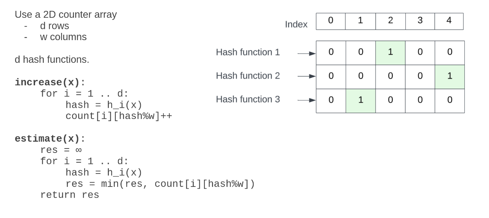

# Count-min sketch

## What

- Count-min sketch is a probabilistic data structure. It estimates the frequency of an element in a data stream.
- Commands:
  - **CMS.INITBYPROB**: `CMS.INITBYPROB key error probability`
  - **CMS.INCRBY**: `CMS.INCRBY key item increment [item increment ...]`
  - **CMS.QUERY**: `CMS.QUERY key item [item ...]`

## Why

Suppose you run a service that processes a stream of user search queries. You want to track how often each unique query appears.

- 50 million unique queries
- Each query is about 20 characters long

### Approach 1: Hash Map

A straightforward approach is to store counts in a hash map.

- Memory per entry: \~40 bytes in 64-bit

  - String (11 bytes actual string + 16 bytes header = 27 bytes) (e.g. "Hello world")
  - A pointer (8 bytes): Point to entry in bucket, or metadata to handle collision (e.g. key, next in diagram)

  ```python
  HashMap
  ┌───────────┐
  │  bucket 0 │ ──> [ key="hello", value=5, next=None ]
  ├───────────┤
  │  bucket 1 │ ──> None
  ├───────────┤
  │  bucket 2 │ ──> [ key="world", value=3, next=None ]
  └───────────┘
  ``

  - The counter (8 bytes): frequency of key (e.g. value in diagram)
  - Allocator overhead (4-8 bytes): Overhead because of memomry allocator

  ```

- Total: $$50,000,000 \times 40 = 2,000,000,000\ bytes ≈ 2 GB$$

👉 Accurate but memory heavy.

### Approach 2: Count-min Sketch

A Count-min Sketch (CMS) uses sublinear memory by trading exact accuracy for probabilistic estimates.



- Space complexity: \$O(d \times w)\$

  - Example: \$d=5\$, \$w=200\$
  - Memory = \$5 \times 200 \times 4\$ bytes = **4 KB**

- Time complexity: \$O(d)\$ per update or query

👉 From **2 GB → 4 KB**, with a small probability of overcounting.

**Formulas for parameters**:

- Width:

  $$
  w = \left\lceil \frac{e}{\varepsilon} \right\rceil
  $$

- Depth:

  $$
  d = \left\lceil \ln\left(\frac{1}{\delta}\right) \right\rceil
  $$

Where:

- ${\varepsilon}$ = error rate (e.g. 0.01)
- ${\delta}$ = error probability (e.g. 0.001)
- $e{\approx 2.718}$ (Euler’s number)

### Approach 3: HyperLogLog (the best)

For estimating the number of **unique elements** (not frequency), HyperLogLog is even more memory-efficient.

## How


Use a 2D counter array

- d rows (hash functions)
- w columns

```python
increate(x):
  for i = 1 .. d:
    hash = h_i(x)
    count[i][hash%w]++
```

```python
estimate(x):
  res = +∞
  for i = 1 .. d;
    hash = h_i(x)
    res = min(res, count[i][hash%w])
    return res
```

## When

- Network Traffic Analysis
- Real-time Analytics
- Heavy Hitter Detection
